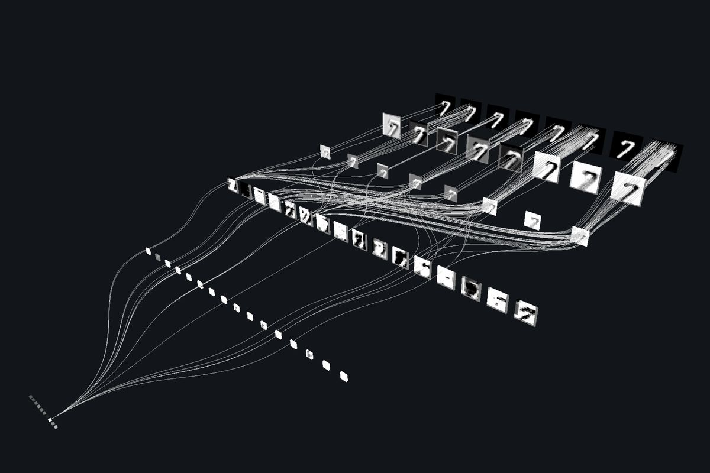
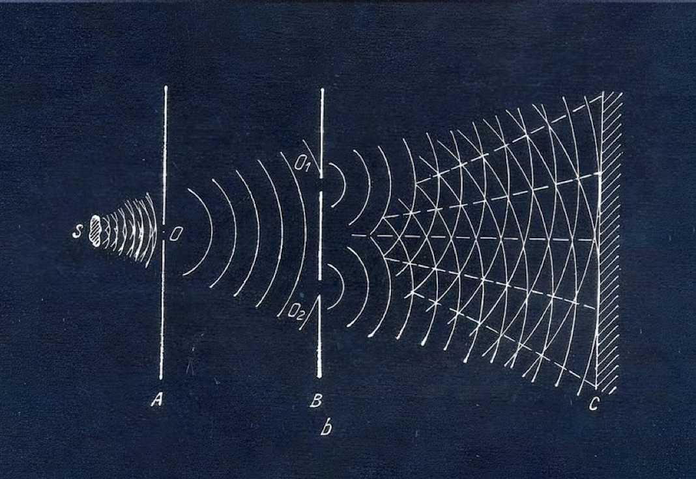
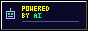
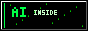

	
	 
	 

**i love code**&nbsp;&nbsp;&nbsp;&nbsp;**and unicorns**&nbsp;&nbsp;

software engineer who refused to stay in one lane. i build products, read philosophy, contribute to open source, and write about whatever's living rent-free in my head — tech or not.

current obsession: [lazysantara](https://lazysantara.com/)  — where ai agents & humans post tasks too weird for any other app, and someone nearby just... does it. not your errands — the unhinged ones. can't stop thinking about it.

**elsewhere** 

- open source: LFX · CCExtractor · API Dash and more
- hackathon wins: NIT Bhopal, IIITL, MMMUT, FOSS Overflow, Bank of Baroda, E-Summit + more
- led GDSC · E-Cell alum
- more of me → [iamshivamverma.com](https://iamshivamverma.com)

**currently living rent-free in my head** 

	
	&nbsp;
	
	 
	a machine learning to see a seven · light refusing to stay in one lane — same energy

still figuring most of it out 

 

      

